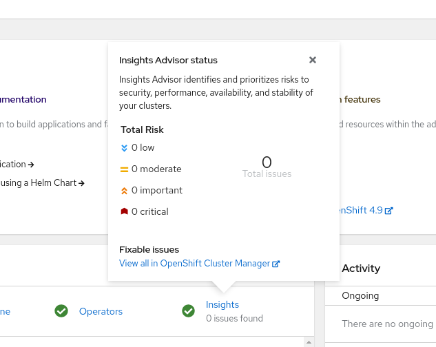

# Interface with OCP WebConsole

The CCX team administers only Insights Advisor widget displayed on the homepage dashboard.

The Insights Advisor plugin utilizes only Prometheus metrics as a source of data. The data is provided with `k8sresult` parameter sent to the widget.

In the future, it is planned to utilize Smart Proxy API instead.
