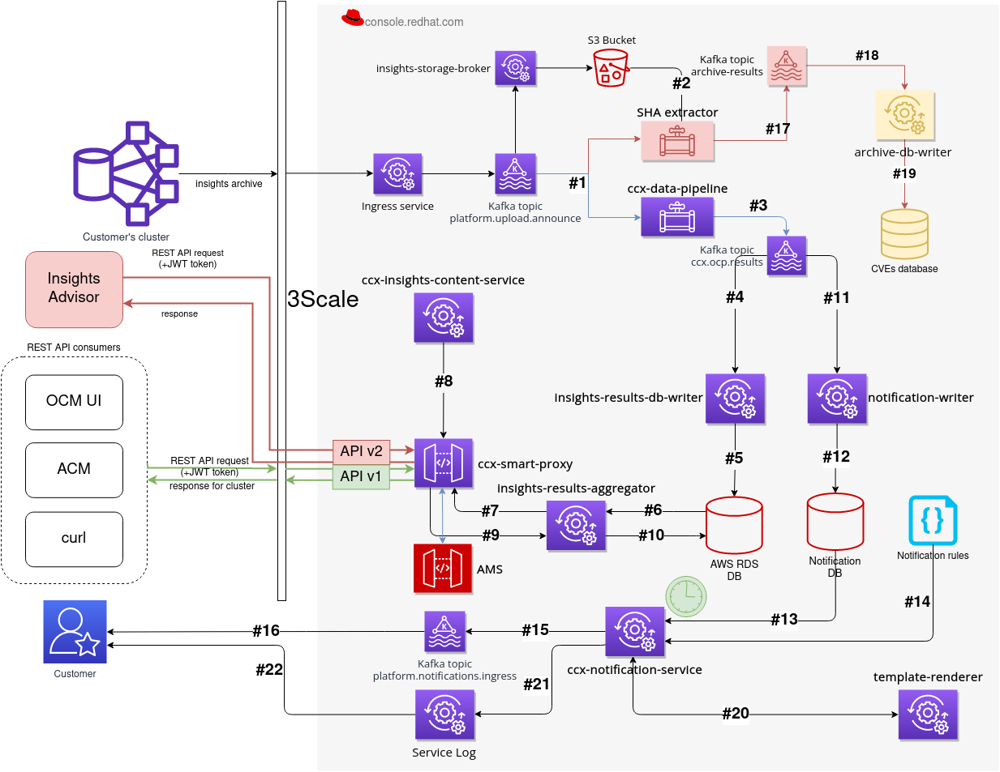

# Overall architecture

<map name="external-data-pipeline-overall-architecture">
    <area shape="rect" coords="80, 136, 233, 303"    title="Customer cluster"   alt="Customer cluster"   href="component/customer-cluster.html">
    <area shape="rect" coords="1086, 599, 1214, 719" title="Notification rules" alt="Notification rules" href="component/notification-rules.html">
</map>
